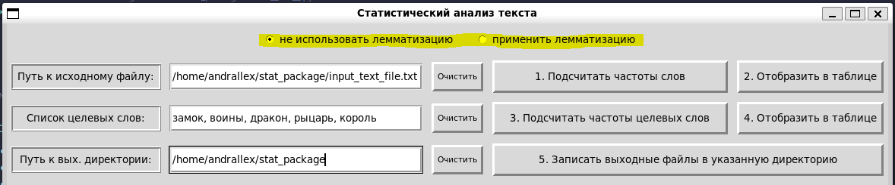
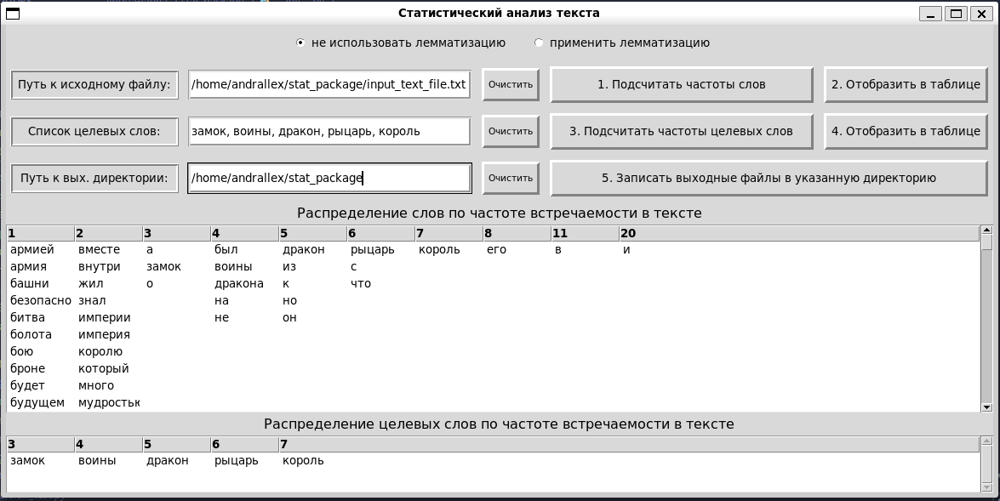
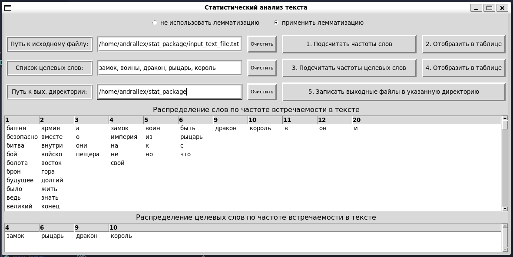

### Описание порядка работы с приложением "Статистический анализ текста"

1. Приложение *"Статистический анализ текста"* позволяет обрабатывать текст как с применением лемматизации так и без ее использования.
	Выбор варианта реализуется переключателем в самой верхней части главного окна приложения.

  
2. Для начала работы нужно указать абсолютный путь к файлу с исходным текстом.

	Затем подсчитать частоты встречаемости слов в тексте и отобразить полученный результат в таблице. Для этого следует последовательно выполнить команды:
	- **"1. Подсчитать частоты слов"** и
	- **"2. Отобразить в таблице"**.

	По умолчанию таблица *"Распределение слов по частоте встречаемости в тексте"* автоматически сохраняется в файл **df_all_words_occurences.csv** в той же директории из которой запускается приложение.

3. Далее для исследования частоты встречаемости заданного списка слов следует внести этот список в поле *"Список целевых слов"*.

	Затем подсчитать частоты встречаемости целевых слов и вывести их в таблицу. Это достигается последовательным выполнением команд: 
	- **"3. Подсчитать частоты целевых слов"** и 
	- **"4. Отобразить в таблице"**.

	По умолчанию таблица *"Распределение слов по частоте встречаемости в тексте"* автоматически сохраняется в файл **df_target_words_occurences.csv** в той же директории из которой запускается приложение.

4. При необходимости записать выходные файлы **df_all_words_occurences.csv** и **df_target_words_occurences.csv** в другую директорию, следует указать абсолютный путь к этой директории в поле *"Путь к вых. директории"* и выполнить команду **"5. Записать выходные файлы в указанную директорию"**.

5. Пример обработки текста без учета лемматизации:

6. Пример обработки текста с учетом лемматизации:

